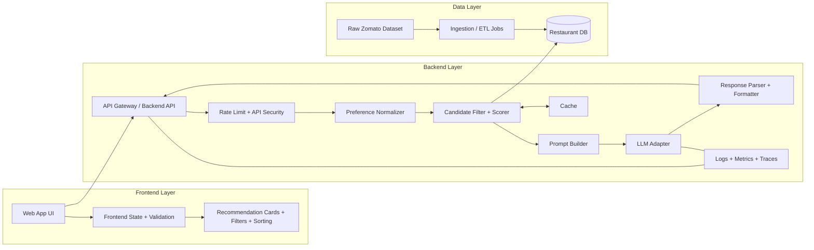
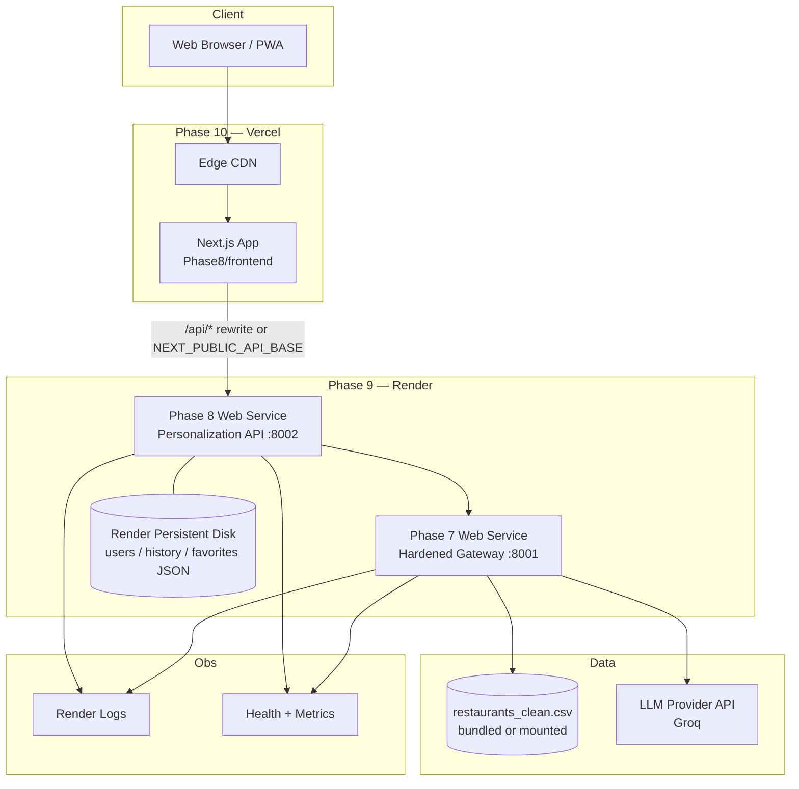

# Phase-Wise Architecture: AI-Powered Restaurant Recommendation System

This document presents a detailed, phase-wise architecture for the restaurant recommendation system described in `Docs/Problemstatment.md`.  
It separates backend and frontend responsibilities and includes deployment architecture.

## 1) End-to-End Architecture Overview



---

## 2) Phase-Wise Architecture (Phase 0 to Phase 10)

## Phase 0: Foundation and Planning

**Goal:** Define architecture boundaries, contracts, and quality criteria before coding.

**Backend Scope:**
- Define API contracts for recommendation flow.
- Finalize data model (`RestaurantRecord`, `UserPreference`, `RecommendationItem`).
- Define prompt strategy (input size limits, output schema, guardrails).
- Set non-functional targets (latency, availability, cost, throughput).

**Frontend Scope:**
- Define UX flow: input form -> loading state -> recommendation cards -> refinement.
- Define state model for filters and user preference persistence.
- Create wireframes for desktop/mobile responsiveness.

**Deliverables:**
- API spec draft
- Data schema
- Prompt specification
- Definition of done for each phase

---

## Phase 1: Data Ingestion and Standardization

**Goal:** Create reliable, normalized restaurant data ready for recommendation logic.

**Backend Responsibilities:**
- Build ingestion pipeline for Hugging Face Zomato dataset.
- Clean data (null handling, type conversion, deduplication).
- Normalize location/cuisine names and price buckets.
- Store normalized records in database with indexes.

**Frontend Responsibilities:**
- No user-facing logic yet.
- Optionally create internal admin page to inspect loaded data statistics.

**Inputs:**
- Raw dataset files

**Outputs:**
- Query-ready restaurant dataset in persistent store

---

## Phase 2: Preference Capture and Validation

**Goal:** Collect and validate user intent in a consistent structure.

**Backend Responsibilities:**
- Build endpoint: `POST /recommendations`.
- Validate input schema (location, budget, cuisine, min rating, optional tags).
- Normalize synonyms (e.g., "cheap" -> "low", city alias mapping).
- Reject invalid requests with clear error codes/messages.

**Frontend Responsibilities:**
- Build recommendation form (location, budget, cuisine, rating, preferences).
- Add client-side validations and helpful UX messages.
- Implement loading and retry states.

**Inputs:**
- User form data

**Outputs:**
- Validated `UserPreference` payload to recommendation service

---

## Phase 3: Candidate Retrieval and Rule-Based Ranking

**Goal:** Reduce full dataset to relevant candidates before LLM reasoning.

**Backend Responsibilities:**
- Apply hard filters:
  - location match
  - budget band match
  - minimum rating threshold
- Apply soft scoring:
  - cuisine match score
  - optional tag match score
  - popularity/rating tie-breakers
- Select top-N candidates for LLM prompt context.
- Cache frequent query patterns to reduce DB and LLM load.

**Frontend Responsibilities:**
- Show "filtering candidates" progress state.
- Optional debug mode for internal builds to show candidate count.

**Inputs:**
- Normalized preference payload
- Indexed restaurant dataset

**Outputs:**
- Candidate list (top-N) with metadata scores

---

## Phase 4: LLM Recommendation and Explanation Generation

**Goal:** Convert structured candidates into personalized recommendations with reasons.

**Backend Responsibilities:**
- Build prompt with:
  - user preferences
  - candidate list
  - strict output schema instructions
- Invoke LLM via provider adapter.
- Parse and validate LLM output (rank integrity, required fields present).
- Apply safety checks and fallback to rule-based output if LLM fails.

**Frontend Responsibilities:**
- Show staged progress:
  - analyzing preferences
  - generating recommendations
- Handle failure gracefully with retry UI and fallback notice.

**Inputs:**
- Candidate list and prompt template

**Outputs:**
- Ranked recommendations with explanations

---

## Phase 5: Response Delivery and User Experience

**Goal:** Present recommendations in a useful and trusted format.

**Backend Responsibilities:**
- Return structured response:
  - recommendation list
  - optional summary
  - metadata (latency, fallback used, request id)
- Add pagination/limit support if required.

**Frontend Responsibilities:**
- Render recommendation cards:
  - name, cuisine, rating, estimated cost, explanation
- Provide sorting and quick filters in UI.
- Support follow-up refinement without full page reset.
- Highlight why each option was chosen.

**Inputs:**
- Structured recommendation API response

**Outputs:**
- Actionable UI for user decision-making

---

## Phase 6: Monitoring, Evaluation, and Continuous Improvement

**Goal:** Improve quality, reliability, and cost over time.

**Backend Responsibilities:**
- Capture metrics:
  - API latency (p50/p95)
  - LLM latency and token usage
  - fallback rate
  - error rate
- Log request traces with anonymized user preferences.
- Run offline evaluation on benchmark preference sets.
- Tune filters, prompt templates, and cache policies.

**Frontend Responsibilities:**
- Capture user feedback (thumbs up/down, relevant/not relevant).
- Track UX metrics (form drop-off, retry rate, session completion).
- Feed feedback events to backend analytics pipeline.

**Inputs:**
- Production telemetry + user feedback

**Outputs:**
- Iterative model/prompt/filter improvements

---

## Phase 7: Backend Hardening & API Gateway

**Goal:** Secure, scale, and harden the backend for production traffic.

**Backend Responsibilities:**
- **Rate Limiting & Throttling:** Per-IP and per-user request limits to prevent abuse.
- **API Versioning:** Versioned API routes (`/v1/recommendations`) for backward compatibility.
- **Authentication & Authorization:**
  - API key or JWT-based access control.
  - Role-based access (admin vs. end-user).
- **Input Sanitization & Security Headers:**
  - XSS prevention, CORS policy tightening.
  - Payload size limits and timeout enforcement.
- **Circuit Breaker:** Protect against LLM provider outages with automatic fallback.
- **Request Deduplication:** Prevent duplicate LLM calls for identical preferences.

**Frontend Responsibilities:**
- Handle `429 Too Many Requests` with graceful retry backoff.
- Display user-friendly auth errors and session expiry messages.

**Inputs:**
- Existing Phase 5 backend

**Outputs:**
- Production-hardened API with security and reliability controls

---

## Phase 8: Advanced Frontend & Personalization

**Goal:** Elevate the frontend from a single-page form to a rich, personalized experience.

**Backend Responsibilities (Phase 8 API — port 8002):**
- **User Profiles & History:**
  - Store user preferences and past searches.
  - Suggest "recent searches" and "favorites."
- **Recommendation History API:** `GET /api/v1/history?userId={id}`
- **Saved Restaurants:** `POST /api/v1/favorites` and `GET /api/v1/favorites`
- **Dataset metadata APIs:** `GET /api/v1/locations`, `GET /api/v1/cuisines` (dropdown sources)
- **Proxy to Phase 7:** Forward `POST /api/v1/recommendations` and `POST /api/v1/feedback` to the hardened gateway

**Frontend Responsibilities (Next.js 14 — port 8082):**
- **Progressive Web App (PWA):**
  - Service worker for offline access to last recommendations.
  - Installable app experience on mobile.
- **Personalized Dashboard:**
  - Time-of-day greeting with editable display name.
  - Recent-search chips for one-click replay.
- **Map Integration:**
  - OpenStreetMap tiles via Leaflet with restaurant pins.
  - List / map view toggle.
- **Dark Mode & Accessibility:**
  - Theme toggle, ARIA labels, keyboard navigation, skip links.
- **Social Sharing:** Share recommendation cards via Web Share API or clipboard.

**Inputs:**
- User identity and history data
- Phase 7 gateway (`PHASE7_BASE`)

**Outputs:**
- Engaging, personalized, and accessible web application (`Phase8/frontend`, `Phase8/backend`)

---

## Phase 9: Backend Deployment on Render

**Goal:** Deploy the production backend stack to [Render](https://render.com) with managed hosting, health checks, and environment-based configuration.

**Services to Deploy on Render:**

| Render Service | Code Path | Role |
|----------------|-----------|------|
| **Phase 7 Web Service** | `Phase7/backend` | Hardened recommendation API gateway (rate limit, auth, circuit breaker) |
| **Phase 8 Web Service** | `Phase8/backend` | Personalization API (profiles, history, favorites, location/cuisine metadata) |

**Phase 7 — Render Web Service Configuration:**
- **Runtime:** Python 3.10+
- **Build command:** `pip install -r requirements.txt`
- **Start command:** `uvicorn main:app --host 0.0.0.0 --port $PORT`
- **Health check path:** `/v1/health`
- **Environment variables:**
  - `GROQ_API_KEY` — LLM provider key (from Render secret store)
  - `GROQ_MODEL` — model identifier (e.g. `llama-3.3-70b-versatile`)
  - `PHASE7_API_KEYS` — optional custom API keys for auth middleware

**Phase 8 — Render Web Service Configuration:**
- **Runtime:** Python 3.10+
- **Build command:** `pip install -r requirements.txt`
- **Start command:** `uvicorn main:app --host 0.0.0.0 --port $PORT`
- **Health check path:** `/api/v1/health`
- **Environment variables:**
  - `PHASE7_BASE` — public URL of the Phase 7 Render service (e.g. `https://rrs-phase7.onrender.com`)
  - `PHASE8_DEFAULT_KEY` — API key forwarded to Phase 7
  - `PHASE8_DATASET` — optional path override for `restaurants_clean.csv`
- **Persistent disk (recommended):** Mount a Render disk at `Phase8/backend/data` so `users.json`, `history.json`, and `favorites.json` survive redeploys.

**Backend Responsibilities:**
- Expose HTTPS endpoints on Render-assigned domains.
- Configure CORS to allow the Vercel frontend origin (Phase 10).
- Use Render environment groups for shared secrets across Phase 7 and Phase 8.
- Enable auto-deploy from `main` branch (optional).

**Inputs:**
- Containerized or native Python services
- Environment secrets and inter-service URLs

**Outputs:**
- Public HTTPS URLs for Phase 7 and Phase 8 APIs
- Production-ready backend reachable by the Vercel-hosted frontend

---

## Phase 10: Frontend Deployment on Vercel

**Goal:** Deploy the Phase 8 Next.js application to [Vercel](https://vercel.com) with CDN-backed static assets, preview deployments, and production API routing to the Render backend.

**Vercel Project Configuration:**

| Setting | Value |
|---------|-------|
| **Root directory** | `Phase8/frontend` |
| **Framework preset** | Next.js |
| **Build command** | `npm run build` (default) |
| **Output** | Next.js App Router (`.next`) |
| **Node.js version** | 18+ |

**Environment Variables (Vercel):**
- `NEXT_PUBLIC_API_BASE` — public URL of the Phase 8 Render service (e.g. `https://rrs-phase8.onrender.com/api/v1`)
- `NEXT_PUBLIC_PHASE7_KEY` — optional client-side API key (prefer server-side proxy in production)

**API Routing Strategy:**

In local development, `next.config.js` rewrites `/api/*` to `http://localhost:8002`. In production on Vercel, either:

1. **Rewrite to Render** — update `rewrites()` to point at the Phase 8 Render URL, or
2. **Direct client calls** — set `NEXT_PUBLIC_API_BASE` in the API client (`src/lib/api.ts`) so the browser calls Render directly (requires CORS on Phase 8).

Recommended production flow:

```
Browser  ──►  Vercel (Next.js CDN)  ──/api/* rewrite──►  Render Phase 8  ──►  Render Phase 7
```

**Frontend Responsibilities:**
- Deploy on every push to `main` (production) and on PRs (preview URLs).
- Serve PWA assets (`manifest.json`, `sw.js`, icons) from Vercel edge.
- Configure `theme_color` and security headers via `next.config.js` / `vercel.json`.
- Validate that map tiles (OpenStreetMap), recent searches, and favorites work against the live Render APIs.

**DevOps Responsibilities:**
- Connect GitHub repo to Vercel with branch-based deployments.
- Set Vercel environment variables per environment (Preview vs Production).
- Smoke-test preview deployments against staging Render services before promoting.

**Inputs:**
- Built Next.js application (`Phase8/frontend`)
- Render Phase 8 public URL and API keys

**Outputs:**
- Production frontend URL (e.g. `https://dinewise-ai.vercel.app`)
- Preview URLs for each pull request
- End-to-end path: Vercel UI → Render Phase 8 → Render Phase 7 → LLM

---

## 3) Backend Architecture (Detailed)

### Core Services
- **API Service:** request routing, auth, validation, response contract.
- **Recommendation Service:** orchestration across filter engine and LLM adapter.
- **Data Service:** access to normalized restaurant records and indexes.
- **Prompt Service:** template versioning and prompt construction.
- **LLM Adapter:** provider abstraction (OpenAI/Gemini/others).
- **Fallback Engine:** deterministic ranking when LLM is unavailable.
- **Observability Module:** structured logs, metrics, tracing.

### Suggested Backend Modules
- `api/` (routes, controllers, DTOs)
- `domain/` (entities, ranking logic)
- `services/` (recommendation orchestration, prompting)
- `repositories/` (DB access)
- `integrations/` (LLM provider, external APIs)
- `jobs/` (ingestion and periodic refresh)

### Suggested API Endpoints
- `POST /recommendations` - main recommendation endpoint
- `GET /health` - service health
- `GET /metrics` - monitoring endpoint (protected)
- `POST /feedback` - user quality feedback collection

---

## 4) Frontend Architecture (Detailed)

### Core UI Modules
- **Preference Form Module**
  - Location, budget, cuisine, minimum rating, optional preferences
- **Recommendation Results Module**
  - Card list, summary section, sort/filter controls
- **Feedback Module**
  - Per-recommendation feedback and optional comments
- **State Management Module**
  - Request lifecycle, errors, retries, cache/local persistence

### Suggested Frontend Structure
- `pages/` or `routes/`
- `components/`
- `features/recommendation/`
- `services/apiClient/`
- `store/` (state + caching)
- `types/` (shared DTO interfaces)

### UX Requirements
- Fast perceived response with progressive loading states
- Clear distinction between rule-based and AI-generated reasoning
- Mobile-friendly card layout and accessible form controls

---

## 5) Deployment Architecture

## Environment Strategy
- **Dev:** local development with mock or limited dataset.
- **Staging:** production-like environment with full integration tests.
- **Production:** scaled deployment with monitoring, autoscaling, and alerting.

## Deployment Topology (Production — Phase 9 + 10)



### Render + Vercel Checklist

| Step | Platform | Action |
|------|----------|--------|
| 1 | Render | Deploy Phase 7 web service; note public URL |
| 2 | Render | Deploy Phase 8 web service; set `PHASE7_BASE` to Phase 7 URL |
| 3 | Render | Attach persistent disk to Phase 8 for `data/*.json` |
| 4 | Render | Configure secrets (`GROQ_API_KEY`, API keys) |
| 5 | Vercel | Import repo; set root to `Phase8/frontend` |
| 6 | Vercel | Set env vars pointing at Phase 8 Render URL |
| 7 | Vercel | Update `next.config.js` rewrites for production API host |
| 8 | Both | Enable CORS on Phase 8 for Vercel domain; smoke-test end-to-end |

## CI/CD Pipeline (Recommended)
- **Frontend (Vercel):** Auto-deploy on push to `main`; preview deployments per PR.
- **Backend (Render):** Auto-deploy on push to `main` (optional); manual promote for production.
- Run lint and unit tests on each PR via GitHub Actions before merge.
- Run smoke tests after deploy: `GET /v1/health`, `GET /api/v1/health`, sample `POST /api/v1/recommendations`.
- Use Render deploy hooks and Vercel deployment notifications for rollback awareness.

## Runtime and Security Considerations
- Keep secrets in a secret manager; do not hardcode API keys.
- Apply request rate limiting and payload size limits.
- Enforce HTTPS and secure headers.
- Add timeout and retry policies for LLM calls.
- Use circuit breaker around LLM adapter to protect API uptime.

---

## 6) Shared Data Contracts

### `UserPreference`
- `location: string`
- `budget: "low" | "medium" | "high"`
- `cuisine: string`
- `minRating: number`
- `tags?: string[]`

### `RestaurantRecord`
- `id: string`
- `name: string`
- `location: string`
- `cuisine: string[]`
- `avgCostForTwo: number`
- `budgetBand: "low" | "medium" | "high"`
- `rating: number`
- `tags?: string[]`

### `RecommendationItem`
- `rank: number`
- `restaurantId: string`
- `name: string`
- `cuisine: string`
- `rating: number`
- `estimatedCost: number`
- `reason: string`

### `RecommendationResponse`
- `requestId: string`
- `recommendations: RecommendationItem[]`
- `summary?: string`
- `usedFallback: boolean`
- `latencyMs: number`

---

## 7) Implementation Roadmap

1. Complete Phase 0 architecture and contract sign-off.
2. Deliver Phase 1 ingestion pipeline and data quality checks.
3. Implement Phase 2 API + frontend form with strict validation.
4. Implement Phase 3 filtering, scoring, and caching.
5. Integrate Phase 4 LLM adapter, prompt templates, and fallback.
6. Implement Phase 5 polished UI and response metadata.
7. Roll out Phase 6 observability, feedback loop, and iterative tuning.
8. Harden backend with Phase 7 security, rate limiting, and circuit breakers.
9. Enhance frontend with Phase 8 personalization, PWA, and map integration.
10. Deploy Phase 7 and Phase 8 backends to **Render** (Phase 9).
11. Deploy Phase 8 Next.js frontend to **Vercel** (Phase 10) and wire API rewrites to Render.

## 8) Technology Stack Summary

| Layer | Technologies |
|-------|-------------|
| Data Ingestion | Python, Pandas, Hugging Face `datasets` |
| Backend API | FastAPI, Pydantic, Uvicorn |
| LLM Integration | Groq API, OpenAI-compatible adapters |
| Frontend | Next.js 14, TypeScript, Tailwind CSS, Leaflet |
| Personalization Store | JSON files (`Phase8/backend/data`) |
| Observability | Structured JSON logging, in-memory metrics store |
| Evaluation | Python benchmark runner, precision/latency/fallback metrics |
| Backend Hosting (Phase 9) | [Render](https://render.com) Web Services + persistent disk |
| Frontend Hosting (Phase 10) | [Vercel](https://vercel.com) (Next.js, edge CDN, preview deploys) |
| CI/CD | GitHub Actions (tests) + Vercel/Render auto-deploy |

This expanded phase-wise design keeps backend and frontend independently scalable. Phase 9 (Render) and Phase 10 (Vercel) provide a managed production path without self-hosted Kubernetes, while Phases 0–8 deliver the core recommendation product.
